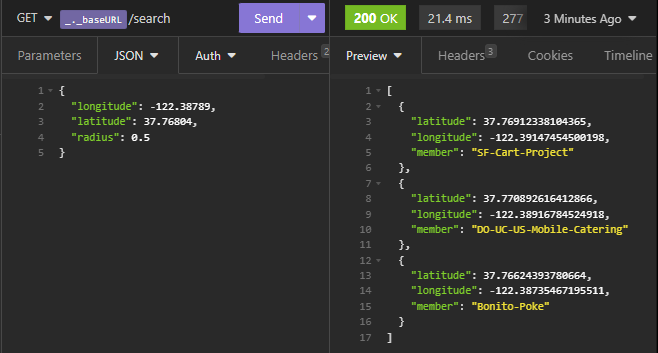

<h2 align="center"> Uber </h2>

  <a href="https://github.com/uber-archive/coding-challenge-tools/blob/master/coding_challenge.md" target="_blank"> Desafio Backend </a> UBER, proposto em 2016 

 O problema consiste em crar um serviço que indica ao usuário quais tipos de food trucks podem ser encontrados próximo a uma determinada localização no mapa.

## Detalhes:
    1.0: Para cada requisição enviada para a API externa, os resultados são salvos em cache (Redis)
    
        1.1: Foram usadas estruturas de dados e funções específicas para armazenamento de dados geográficos
        
        1.2: O cache é verificado antes de qualquer consulta à API externa, que só é consultada caso a informação buscada não seja encontrada

  <h3>Stack Usada</h3>
  <ul>
    <li>Java 17</li>
    <li>SpringBoot</li>
    <li>Redis (Jedis Client)</li>
  </ul>

API Consumida disponível em: [DataSF](http://www.datasf.org/): [Food
Trucks](https://data.sfgov.org/Permitting/Mobile-Food-Facility-Permit/rqzj-sfat)

  <h3>Requisição Exemplo</h3>
  

## Linkedin e Gmail

 	

